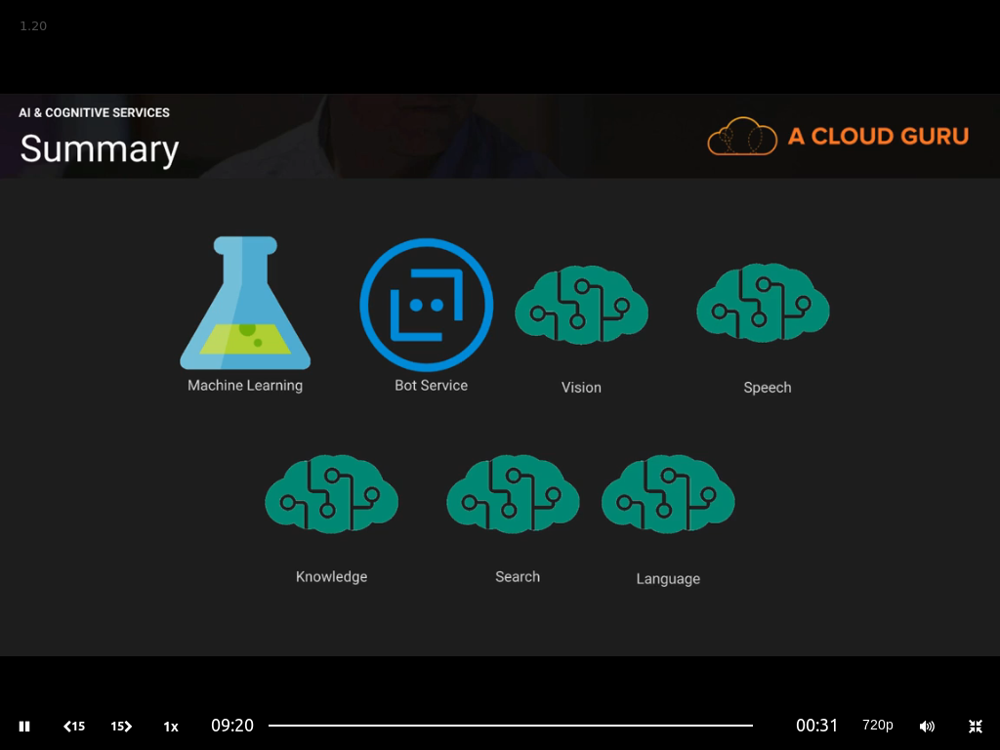
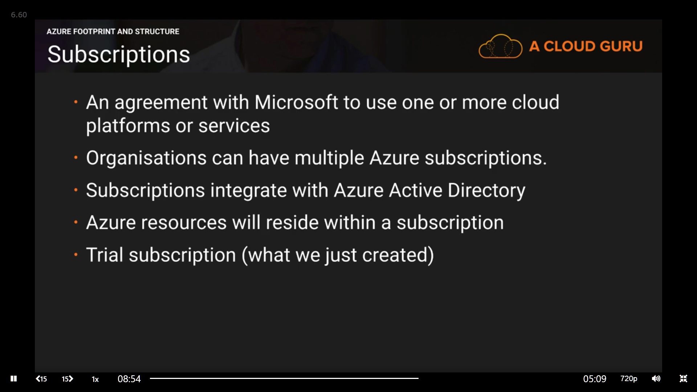
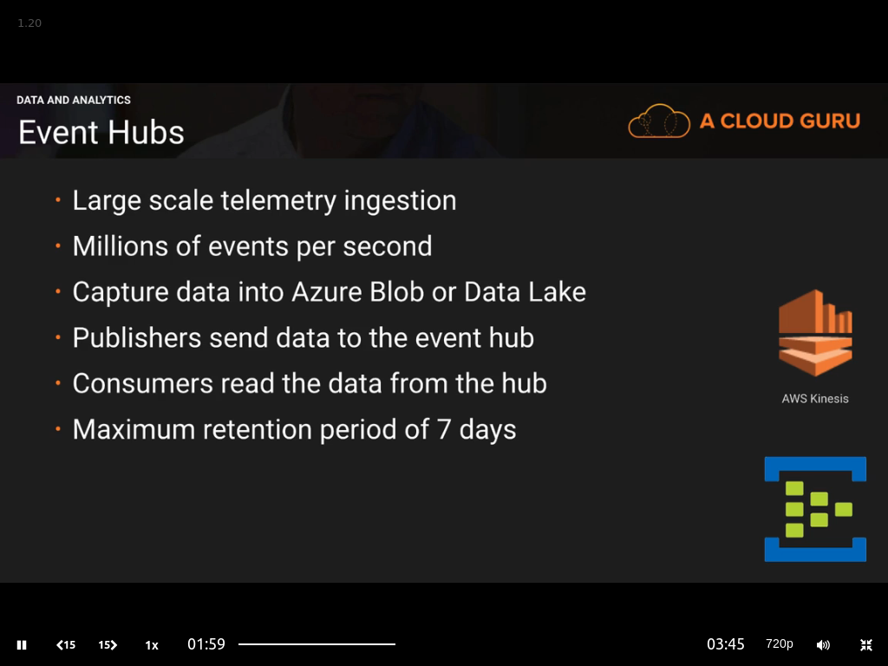
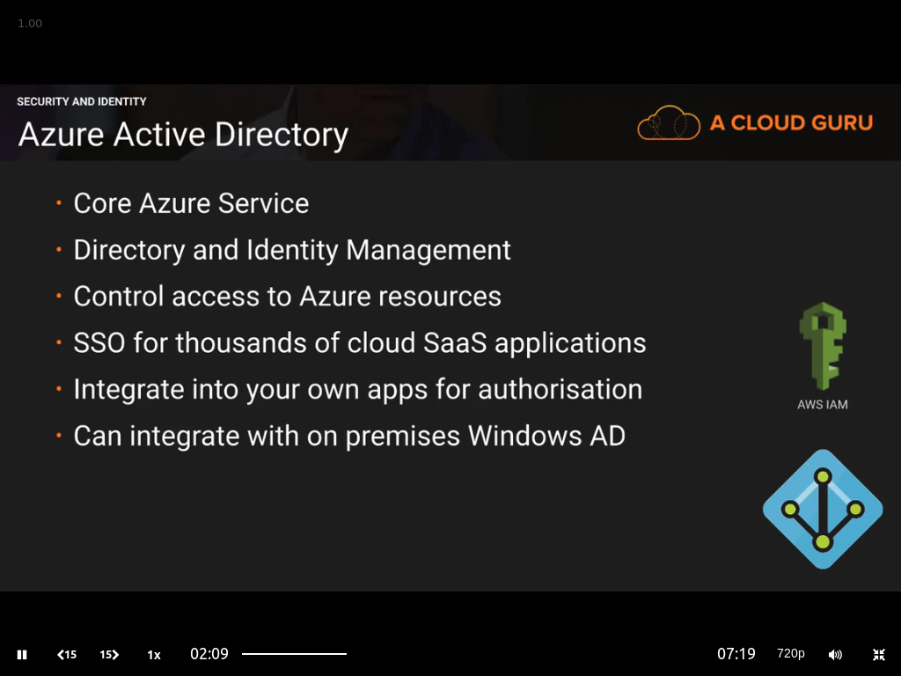
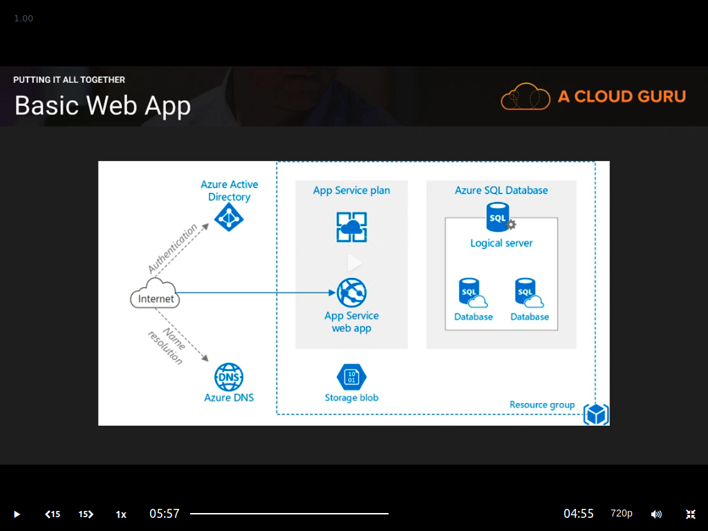

<a id="top" />

# Introduction to Azure - A Cloud Guru 
[Link](https://acloud.guru/course/intro-to-azure/dashboard)

* [Details](#chapter-1---introduction--chapter-2---azure-foundations)

## Summary Content

## Chapter 1 - Introduction & Chapter 2 - Azure Foundations

<a href="#top">Top</a>

## Chapter 3 - Azure Services

### Compute

<a href="#top">Top</a>

### Netwroking

<a href="#top">Top</a>

### Storage

<a href="#top">Top</a>

### Web and Mobile

<a href="#top">Top</a>

### Databases

<a href="#top">Top</a>

### Data and Analytics

<a href="#top">Top</a>

### AI and Cognitive Services

<a href="#top">Top</a>

### IoT

<a href="#top">Top</a>

### Enterprise Integration

<a href="#top">Top</a>

### Security and Identity

<a href="#top">Top</a>

### Monitoring and Management

<a href="#top">Top</a>

## Chapter 4 - Summary

<a href="#top">Top</a>

### Putting It All Together

### Where to Next

The End